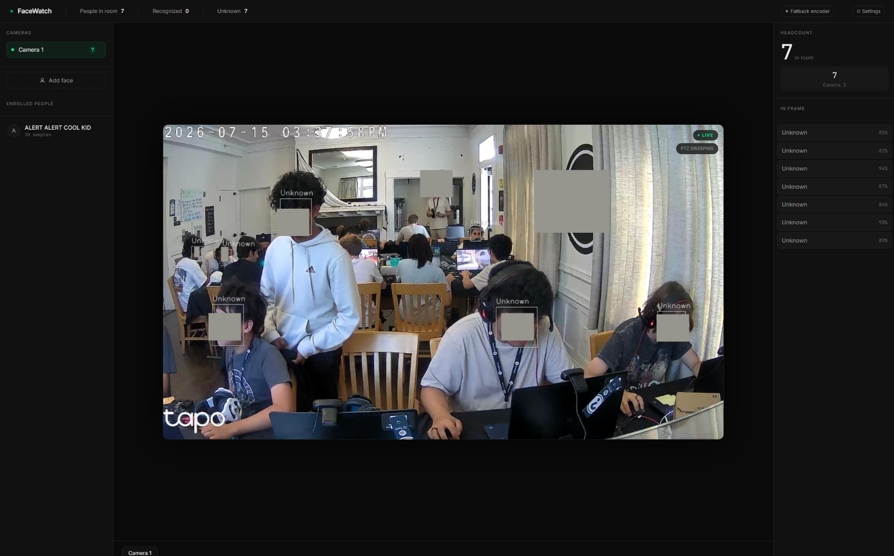

# FaceWatch

Real-time face recognition and people-counting for a room, running on a single NVIDIA Jetson Orin Nano. PTZ cameras patrol the space, faces get detected and matched against enrolled people, and everything shows up on a web dashboard you can open from any device on the network.

The face encoder is a custom CNN I trained from scratch on 192,000 face images using triplet loss. It outputs 512-dimensional embeddings matched with cosine similarity.



---

## What it does

- Live RTSP streams from one or more cameras
- PTZ patrol sweep — moves, stops to scan, moves again
- Face detection via YuNet (OpenCV DNN, runs locally)
- Face recognition via a custom trained encoder
- Headcount per camera + total
- Enroll faces from the PTZ camera or your laptop webcam, directly from the browser
- Adjustable detection and recognition sensitivity
- Hot-swap the encoder model without restarting

---

## Hardware

- NVIDIA Jetson Orin Nano (runs everything)
- Any RTSP camera — tested with Tapo C216 PTZ
- A device to view the dashboard (phone, laptop, whatever's on the same network)

---

## Setup

### 1. Install dependencies

```bash
git clone https://github.com/Orifig/FaceWatch.git
cd FaceWatch
pip install -r requirements.txt
pip install onvif-zeep  # only if you have PTZ cameras
```

### 2. Download models

```bash
python3 download_models.py
```

Downloads YuNet into `./models/`. Then grab `face_encoder.pth` from the [releases page](https://github.com/Orifig/FaceWatch/releases) and drop it in `./models/` too.

### 3. Configure cameras and PTZ

Run the app first:

```bash
python3 app.py
```

Then open `http://localhost:8000/setup` (or `http://JETSON_IP:8000/setup` from another device). Fill in your camera RTSP URLs, credentials, and PTZ details. Hit Save — it writes a `config.json` and redirects you to the dashboard. You only need to do this once.

### 4. Download models

```bash
python3 app.py
```

Open `http://localhost:8000` — or `http://JETSON_IP:8000` from another device.

---

## Enrolling faces

Click **Add face** in the sidebar. Choose between:

- **PTZ Camera** — PTZ pauses, 5-second countdown, captures 20 frames automatically, PTZ resumes
- **PC Webcam** — uses your laptop camera, captures directly in the browser and sends frames to the Jetson

---

## Settings

Click ⚙ in the header to adjust detection and recognition sensitivity with sliders. No restart needed.

After swapping in a new model, click the model badge in the header to hot-reload it.

---

## Training your own encoder

The training code is in the `training/` folder. Architecture: 5-layer CNN → global average pool → 512-dim embedding, trained with triplet loss on [CelebA-faces-cropped-128](https://huggingface.co/datasets/tglcourse/CelebA-faces-cropped-128).

```bash
pip install torch datasets accelerate
python3 training/face_encoder_triplet.py
# Saves to ./outputs/face_encoder.pth
```

---

## Project structure

```
FaceWatch/
├── app.py                  # FastAPI backend
├── dashboard.html          # Web UI
├── face_engine.py          # Detection + encoding
├── face_database.py        # Enrollment storage
├── camera_manager.py       # RTSP stream manager
├── ptz_controller.py       # PTZ sweep controller
├── setup_page.html         # First-boot config UI
├── download_models.py      # Model downloader
└── requirements.txt
```

Demo Video:
https://youtu.be/KZ1oUWJRmjw

